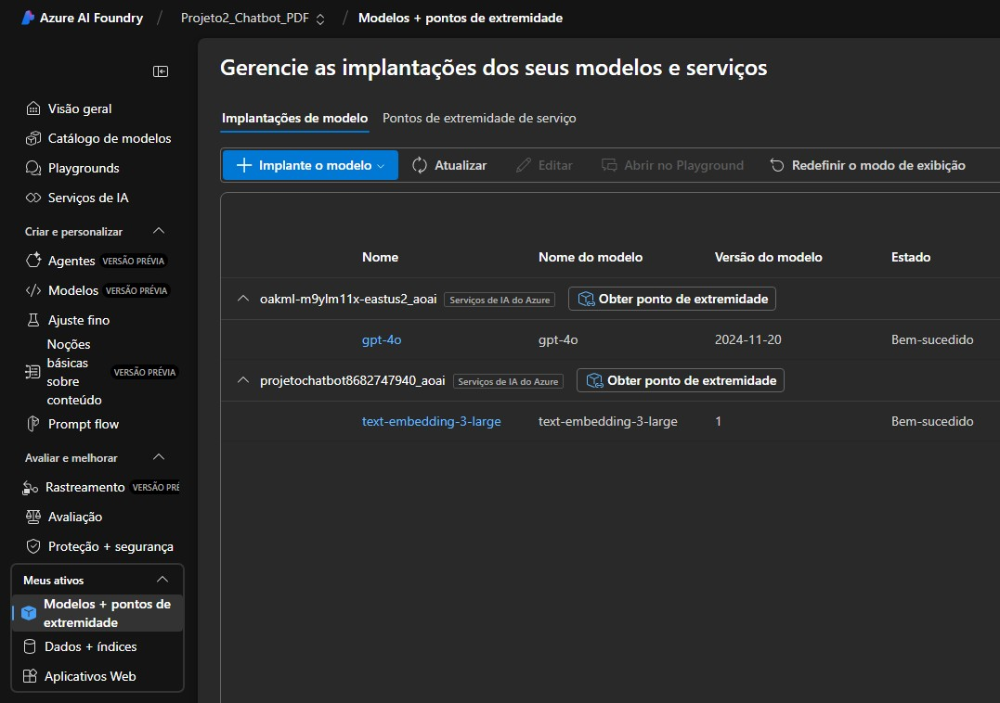
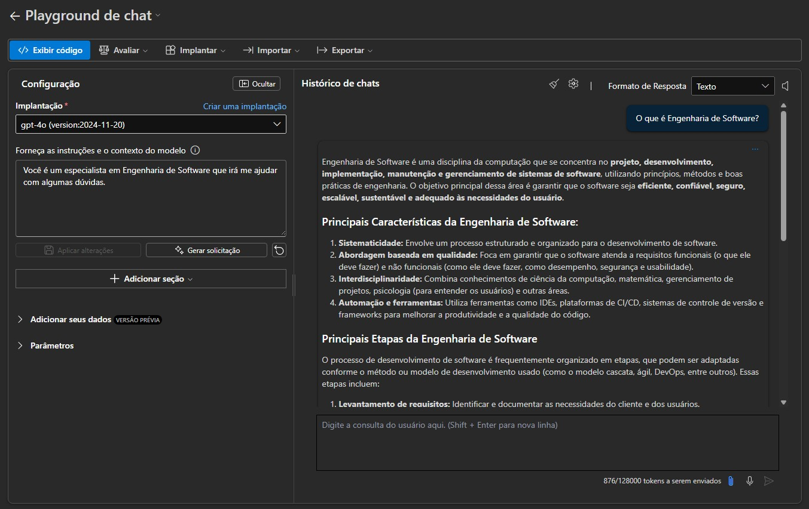
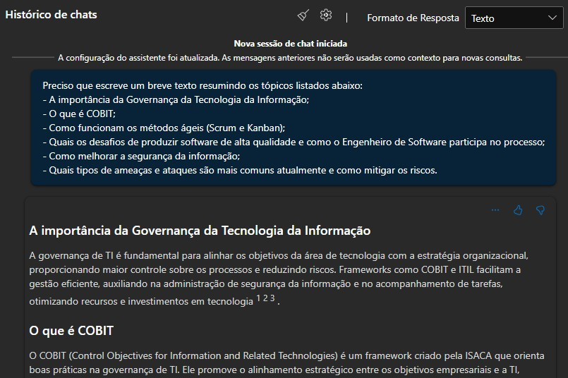
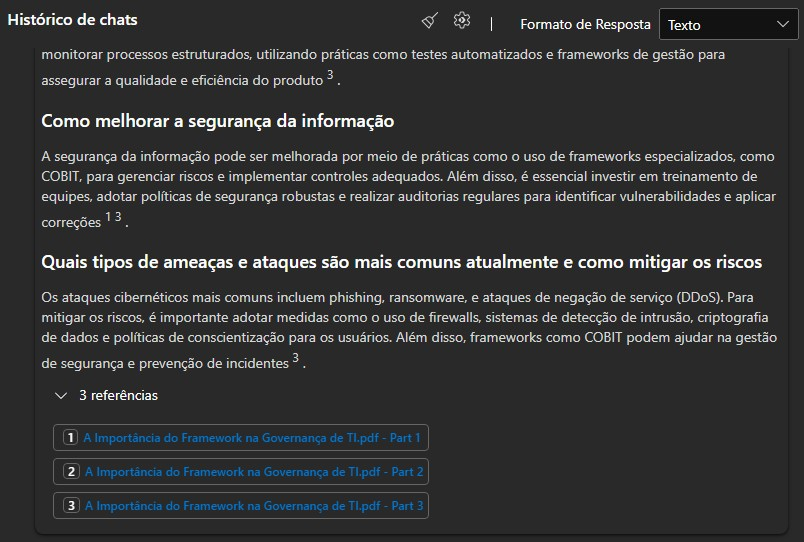

# 📚 Chatbot Inteligente com PDFs usando Azure AI Foundry

Este projeto tem como objetivo aplicar técnicas de Inteligência Artificial Generativa com modelos de Linguagem Natural (LLMs) e buscas vetoriais para construir um **Chat Interativo Baseado em PDFs**. A proposta nasceu como um exercício prático para revisar conteúdos acadêmicos de forma inteligente e contextualizada. Ideal para estudantes, pesquisadores ou profissionais que trabalham com grandes volumes de informação textual.

## 🧠 Visão Geral

Imagine que você está escrevendo seu Trabalho de Conclusão de Curso (TCC) e precisa revisar diversos artigos científicos. No entanto, à medida que a quantidade de PDFs aumenta, torna-se inviável lembrar onde cada conceito foi abordado. Foi pensando nisso que criei este projeto: um **chat inteligente que entende, indexa e responde com base no conteúdo dos seus PDFs**.

Essa solução foi construída utilizando os recursos da plataforma **Azure Machine Learning e Azure AI Foundry**, e une dois modelos de IA:

- 🔍 `text-embedding-3-large` - utilizado para converter os PDFs em vetores semânticos.
- 💬 `gpt-4o` - utilizado para responder perguntas com base nos conteúdos indexados e no treinamento prévio.

---

## 🧱 Arquitetura da Solução

1. **Importação e Indexação de PDFs**  
   Os arquivos PDF foram carregados no ambiente do Azure AI Studio, onde foram processados e convertidos em embeddings vetoriais, possibilitando a busca semântica.

2. **Integração com Modelos**  
   Foram implantados dois modelos: um para **criação de embeddings** e outro para **geração de texto e chat**. Os modelos se comunicam por meio de APIs configuradas diretamente no Azure AI Foundry.

3. **Chat Interativo com Contexto Personalizado**  
   O chat foi alimentado com um prompt inicial, além de instruções personalizadas. Assim, o modelo é capaz de responder perguntas específicas com base no conteúdo dos documentos.

---

## 🖼️ Imagens do Projeto

### 1. Tela de Implantação de Modelos

  
Nesta etapa, os modelos `gpt-4o` e `text-embedding-3-large` foram adicionados. O ambiente permite adicionar outros modelos também, criando uma solução altamente personalizável.

---

### 2. Tela do Playground de Chat

  
No Playground, é possível definir o contexto, regras de comportamento do modelo e realizar perguntas. Nesta imagem, o modelo respondeu com base nas instruções fornecidas e no treinamento prévio do modelo.

---

### 3. Chat com PDFs - Perguntas Personalizadas

  
Após o carregamento e indexação dos PDFs, perguntas específicas foram feitas e respondidas com base no conteúdo dos documentos.

---

### 4. Respostas com Referências Documentais

  
As respostas do modelo incluíram **citações diretas aos arquivos carregados**, reforçando a rastreabilidade da informação.

---

## 💡 Exemplo de Prompt Utilizado

Preciso que escreve um breve texto resumindo os tópicos listados abaixo:

- A importância da Governança da Tecnologia da Informação;
- O que é COBIT;
- Como funcionam os métodos ágeis (Scrum e Kanban);
- Quais os desafios de produzir software de alta qualidade e como o Engenheiro de Software participa no processo;
- Como melhorar a segurança da informação;
- Quais tipos de ameaças e ataques são mais comuns atualmente e como mitigar os riscos.

---

## 🎯 Objetivos Alcançados

- ✅ Carregar e indexar documentos em PDF
- ✅ Implementar busca vetorial com embeddings
- ✅ Utilizar LLMs para gerar respostas com base em documentos proprietários
- ✅ Criar um chat funcional e contextualizado com as informações dos arquivos

---

## 🚀 Possibilidades Futuras

- Exportar a solução como uma **API RESTful** ou uma **interface web interativa**
- Integrar com sistemas educacionais ou corporativos
- Expandir o número de documentos e testar limites de performance
- Realizar fine-tuning dos modelos para maior precisão

---

## 📌 Conclusão

Este projeto mostra o potencial da IA generativa aplicada à extração de conhecimento em contextos específicos. Mesmo com restrições de hardware local, o Azure provê uma infraestrutura poderosa para experiências com LLMs, embeddings e fluxos avançados de NLP.

> 💬 **Dica:** Replicar esse projeto com seus próprios documentos pode transformar radicalmente a forma como você pesquisa e estuda.

---
